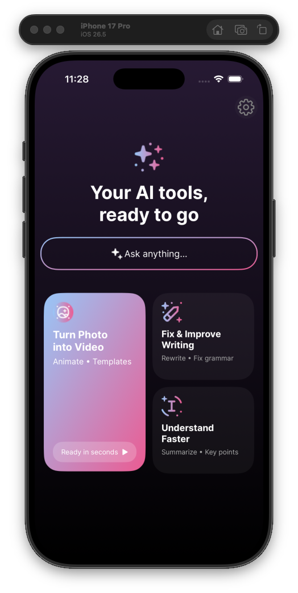
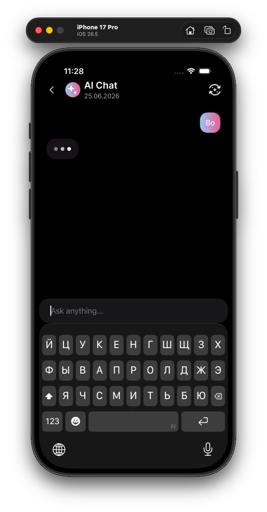
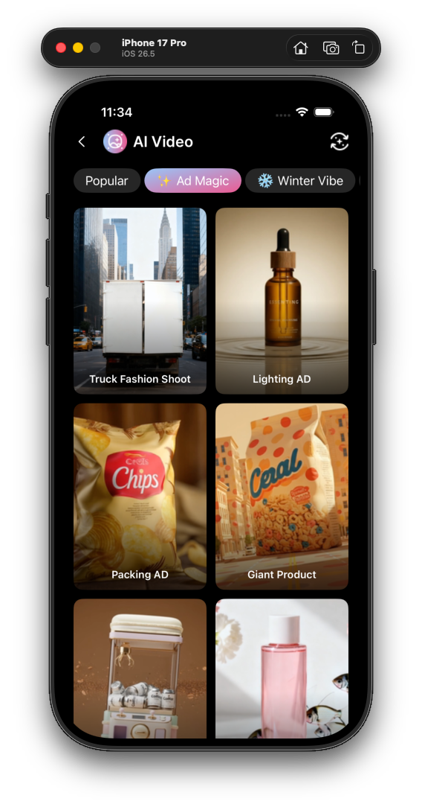
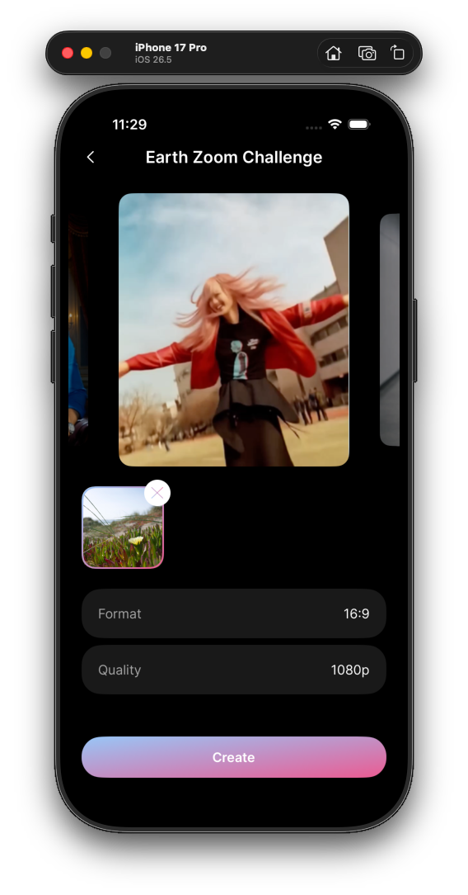
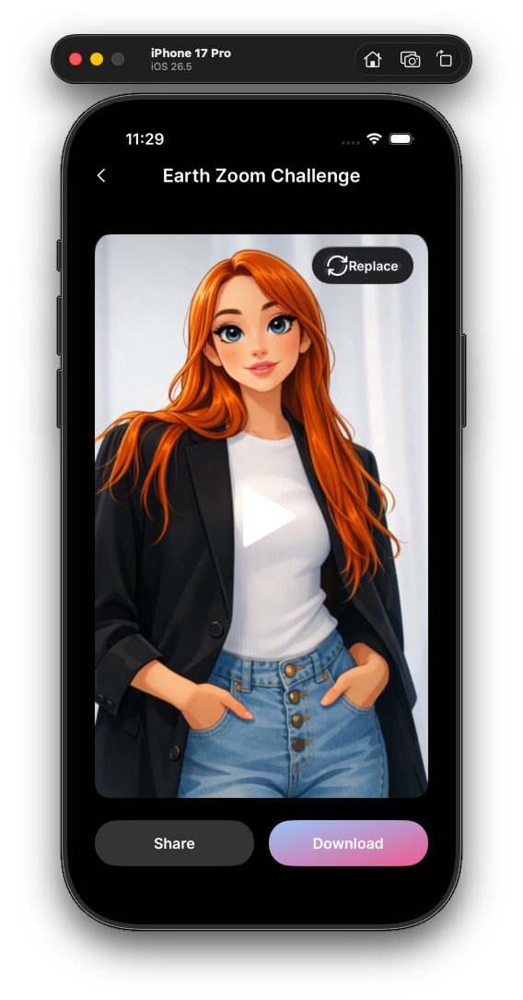
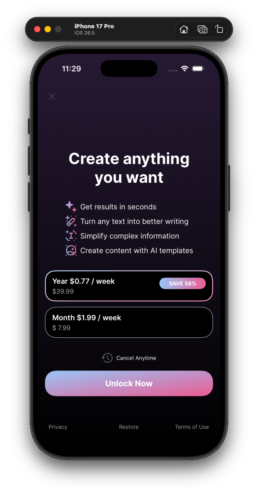

# AI-Powered iOS Application

A comprehensive iOS application featuring AI chat capabilities and photo-to-video conversion using advanced AI technologies.

## Screenshots

  
  
  
    
      
        

## 🎯 Features

### 1. **AI Chat Assistant**
- Real-time AI-powered conversational interface
- Chat history management with categorization (Today, Yesterday, older dates)
- Message threading and context preservation
- Typing indicators with animated bubble effects
- Network-based chat synchronization

### 2. **Photo-to-Video Conversion**
- Transform static photos into dynamic videos
- Template-based video generation
- Integration with Pixverse API for AI video processing
- Video preview and processing status tracking
- Task-based video generation with real-time updates

### 3. **Chat History Management**
- Organized chat list with date-based sections
- Empty state handling
- Network-based chat loading with deduplication
- Error handling and retry mechanisms

### 4. **Video History**
- Browse previously generated videos
- Video thumbnail caching for performance
- Video playback and sharing capabilities

### 5. **Template Gallery**
- Pinterest-style waterfall layout for templates
- Template carousel for featured content
- Template details with video previews
- Category-based template filtering

## 🏗️ Architecture

The project follows the **MVP (Model-View-Presenter)** architectural pattern with **Coordinator** pattern for navigation:

## 🛠️ Tech Stack

- **Language**: Swift
- **UI Framework**: UIKit (programmatic UI with Auto Layout)
- **Networking**: URLSession with async/await
- **Architecture**: MVP + Coordinator
- **Concurrency**: Swift Concurrency (async/await, actors)
- **Image Caching**: NSCache for thumbnail optimization
- **Video Processing**: AVFoundation
